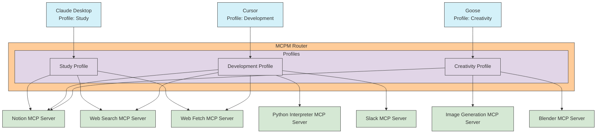

# MCPM Router

The MCPM Router is a module that allows you to aggregate multiple MCP servers (both SSE and STDIO) and expose them as a single SSE server. The router acts in a dual role:

1. **As an MCP Client**: Connects to multiple downstream MCP servers
2. **As an MCP Server**: Provides a unified interface to upstream MCP clients

This design allows for aggregation of capabilities from multiple MCP servers while providing a single, stable connection point for clients. The router also supports profile management to control which servers are available to specific clients.

A key benefit of the MCPM Router is that it maintains persistent connections to MCP servers, allowing multiple clients to share these server sessions. This eliminates the need to start separate server instances for each client, significantly reducing resource usage and startup time.

## How It Works

The MCPM Router sits between your clients and multiple MCP servers, acting as a central hub:

### Key Concepts

#### 1. Unified Access
Clients connect only to the router, not directly to servers. The router provides a single endpoint for accessing capabilities from all connected servers.

#### 2. Profiles
Profiles are configurations within the router that determine which servers' capabilities are exposed to each client:

| Client         | Profile     | Available Servers                                        |
| -------------- | ----------- | -------------------------------------------------------- |
| Claude Desktop | Study       | Notion, Web Search, Web Fetch                            |
| Cursor         | Development | Notion, Python Interpreter, Web Search, Web Fetch, Slack |
| Goose          | Creativity  | Notion, Image Generation, Blender                        |

#### 3. Namespacing
The router prefixes capabilities from different servers to avoid conflicts:
- Tools: `notion_t_pageSearch` or `python_t_executeCode`
- Prompts: `image_p_generatePortrait`
- Resources: `webfetch:https://example.com`

#### 4. Server Connections
The router supports both STDIO (command-line) and Remote (HTTP and SSE) server connections. For example:
- STDIO: Python Interpreter, Blender
- Remote: Web Search, Notion, Slack

#### 5. Shared Server Sessions
The router maintains persistent connections to all configured servers, allowing multiple clients to share the same server sessions. This means:
- Only one instance of each server is needed regardless of client count
- Server initialization happens only once
- State can be shared across clients when appropriate
- Resources like memory and CPU usage are significantly reduced

## Features

- Aggregate multiple MCP servers as a single server
- Support both Remote and STDIO connections to underlying servers
- Namespace capabilities from different servers
- Expose a unified Remote server interface
- Profile-based server access control
- Dynamic configuration reloading
- Share server connections among multiple clients (no need for separate server instances per client)
- Reduce resource usage through connection pooling