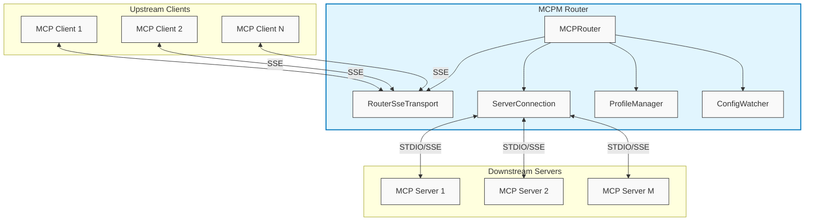
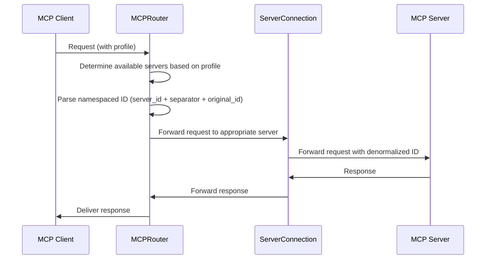

# MCPM Router Technical Overview

## Architecture



## Usage

### Basic Usage

```python
import asyncio
from mcpm.router import MCPRouter
from mcpm.core.schema import STDIOServerConfig, RemoteServerConfig

async def main():
    # Create a router
    router = MCPRouter()

    # Add a STDIO server
    await router.add_server(
        "example1",
        STDIOServerConfig(
            command="python",
            args=["-m", "mcp.examples.simple_server"]
        )
    )

    # Add an Remote server
    await router.add_server(
        "example2",
        RemoteServerConfig(
            url="http://localhost:3000/"
        )
    )

    # Start the Remote server
    await router.start_remote_server(host="localhost", port=8080)

if __name__ == "__main__":
    asyncio.run(main())
```

### Configuration File

By default, the router uses the configuration from file `~/.config/mcpm/profile.json` to manage the servers and profiles.

## Key Components

### `MCPRouter`

The main orchestrator class that provides a unified API for the application:
- Initializes and coordinates all internal components
- Manages connections to downstream servers (add/remove/update)
- Maintains mappings of capabilities, tools, prompts, and resources from downstream servers
- Handles namespacing of capabilities across different servers
- Provides a unified server interface for clients
- Controls profile-based access to downstream servers

### `ServerConnection`

Manages individual connections to downstream MCP servers:
- Handles connection lifecycle for a single server
- Supports different transport types (STDIO, Remote)
- Provides methods to initialize, check health, and gracefully shut down connections
- Exposes the server's capabilities to the router

### `RouterSseTransport` (deprecated)

Extends the SSE server transport to handle client connections:
- Provides an SSE server endpoint for clients to connect
- Maintains mappings between session IDs and client profiles
- Handles message routing between clients and the router
- Manages connection lifecycle events

### `ProfileConfigManager`

Manages server profiles:
- Loads and updates profile configurations
- Associates clients with specific sets of available servers
- Controls which servers are visible to which clients

### `ConfigWatcher`

Monitors configuration changes:
- Watches for changes to the profile configuration files
- Triggers router updates when configurations change
- Enables dynamic reconfiguration without router restart

### `ServerConfig` and Derivatives

Defines the configuration for connecting to downstream servers:
- Base `ServerConfig` class with common properties
- `STDIOServerConfig` for command-line based servers
- `RemoteServerConfig` for HTTP/SSE based servers
- Stores necessary connection parameters (command, args, env, URL)

## Namespacing

The router uses the following namespacing conventions:

- Tools: `{server_id}_t_{tool_name}`
- Prompts: `{server_id}_p_{prompt_name}`
- Resources: `{server_id}:{resource_uri}`
- Resource Templates: `{server_id}:{template_uri}`

This allows the router to route requests to the appropriate server based on the namespaced identifier.

## Communication Flow

### Downstream Connections (Router as Client)

1. Router creates persistent connections to downstream MCP servers using STDIO or remote (Streamable HTTP/SSE)
2. Connections are maintained regardless of upstream client presence
3. Server capabilities are fetched and aggregated with namespacing
4. Connections are managed through the `ServerConnection` class
5. Notifications from servers are routed to appropriate upstream clients

### Upstream Connections (Router as Server)

1. Router provides an streamable HTTP server interface for upstream clients
2. Clients connect with a profile identifier to determine server visibility
3. Client requests are routed to appropriate downstream servers based on profile
4. Responses and notifications are delivered back to clients
5. Session management is handled by `RouterSseTransport`(deprecated)

## Request Routing and Namespacing



## Profile Management

1. Profiles define collections of servers that should be accessible together
2. Clients connect with a profile parameter
3. Router filters available servers based on the client's profile
4. Profile configurations can be updated dynamically
5. Changes to profiles are detected by the ConfigWatcher

## Error Handling

1. Connection errors are isolated to affected servers
2. Failed server connections don't prevent other servers from functioning
3. Proper error propagation from downstream servers to clients
4. Graceful handling of client and server disconnections
5. Pipe errors and other connection issues are properly caught and logged

## Benefits of This Design

1. **Decoupling**: Upstream clients are decoupled from downstream servers
2. **Resilience**: Client disconnections don't affect server connections
3. **Aggregation**: Multiple capabilities from different servers appear as one
4. **Flexibility**: Supports different transport protocols (STDIO, Remote)
5. **Scalability**: Can manage multiple clients and servers simultaneously
6. **Profile-based Access**: Controls which servers are available to which clients
7. **Dynamic Configuration**: Supports runtime changes to server configurations

## Implementation Notes

- All communication follows the MCP protocol specification
- Asynchronous operation using Python's asyncio
- Type-safe interfaces using Python type hints
- Clean separation of concerns between components
- Support for hot reloading of configurations
