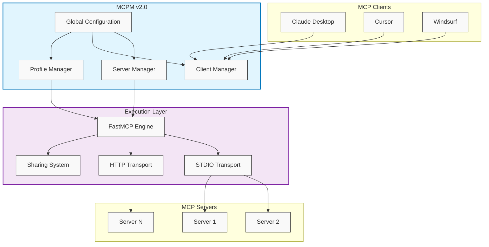

# MCPM v2.0 Technical Architecture

## Overview

MCPM v2.0 adopts a simplified architecture that eliminates the separate router daemon in favor of direct execution and FastMCP-based aggregation. This design provides better performance, reliability, and ease of use.

## Architecture



## Key Components

### Global Configuration Manager

Manages all servers in a single global configuration:

```python
from mcpm.global_config import GlobalConfigManager

config = GlobalConfigManager()
config.add_server(server_config)
servers = config.list_servers()
```

### Profile Manager (Virtual Profiles)

Manages virtual profiles as tags on servers:

```python
from mcpm.profile.profile_config import ProfileConfigManager

profiles = ProfileConfigManager()
profiles.create_profile("web-dev")
profiles.add_server_to_profile("web-dev", "mcp-server-browse")
```

### Client Manager

Handles MCP client integration and configuration:

```python
from mcpm.clients.client_config import ClientConfigManager

clients = ClientConfigManager()
clients.edit_client_config("claude-desktop", selected_servers)
```

### FastMCP Integration

Uses FastMCP for server execution and aggregation:

```python
# Direct server execution
mcpm run server-name

# Profile aggregation
mcpm profile run web-dev --http --port 8080

# Server sharing
mcpm share server-name
mcpm profile share web-dev
```

## Execution Models

### Direct STDIO Execution

Servers run directly via stdio for client integration:

```bash
# Client configuration
{
  "mcpServers": {
    "browse": {
      "command": ["mcpm", "run", "mcp-server-browse"]
    }
  }
}
```

### HTTP Mode for Testing

Servers can run in HTTP mode for development:

```bash
mcpm run server-name --http --port 8080
```

### Profile Aggregation

Multiple servers can be aggregated into a single endpoint:

```bash
mcpm profile run web-dev --http --port 8080
```

## Data Flow

### Server Installation
1. User runs `mcpm install server-name`
2. Server metadata fetched from registry
3. Server configuration stored in global config
4. Server ready for execution or profiling

### Profile Creation
1. User runs `mcpm profile create profile-name`
2. Profile metadata created in global config
3. User adds servers with `mcpm profile edit profile-name`
4. Servers tagged with profile name

### Client Integration
1. User runs `mcpm client edit client-name`
2. MCPM detects client configuration
3. Interactive server selection presented
4. Client config updated with selected servers

### Server Execution
1. Client executes `mcpm run server-name`
2. MCPM loads server config from global storage
3. FastMCP starts server process
4. Stdio/HTTP communication established

## Performance Characteristics

### Advantages of v2.0 Architecture

1. **No Daemon Overhead**: Eliminates router daemon startup and maintenance
2. **Direct Execution**: Reduces latency and complexity
3. **Process Isolation**: Each server runs independently
4. **Resource Efficiency**: Servers only run when needed
5. **Simplified Debugging**: Direct process model easier to troubleshoot

### Resource Management

- **On-Demand Execution**: Servers start only when invoked
- **Process Lifecycle**: Servers terminate with client sessions
- **Memory Efficiency**: No persistent router process
- **Connection Pooling**: FastMCP manages connections efficiently

## Security Model

### Process Isolation
- Each server runs in its own process
- No shared state between servers
- Client-server communication isolated

### Authentication
- Optional authentication for shared servers
- Token-based access control
- Local-only execution for development

### Network Security
- HTTPS for shared servers
- Configurable tunnel endpoints
- Optional authentication for public shares

For more technical details, see the source code documentation and inline comments.