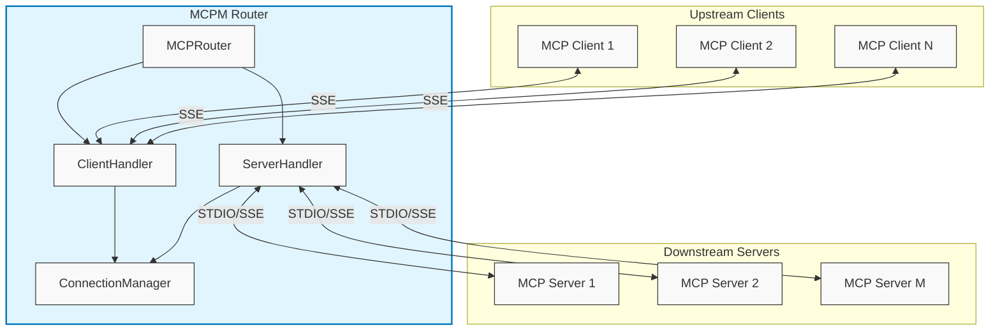
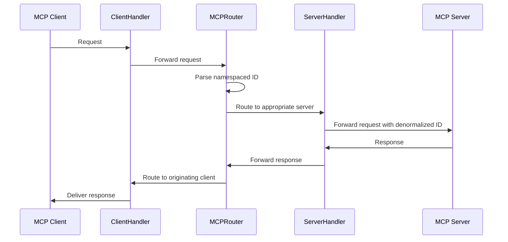

# MCPM Router Design

## Overview

The MCPM Router serves as an intermediary layer within the MCPM (Model Context Protocol Manager) project. The router acts in a dual role:

1. **As an MCP Client**: Connects to multiple downstream MCP servers
2. **As an MCP Server**: Provides a unified interface to upstream MCP clients

This design allows for aggregation of capabilities from multiple MCP servers while providing a single, stable connection point for clients.

## Architecture

## Key Components

### `MCPRouter`

The main orchestrator class that provides a unified API for the application:
- Initializes and coordinates all internal components
- Provides methods for connecting to downstream servers
- Handles server and client routing through appropriate handlers
- Manages namespacing of capabilities across different servers
- Offers a clean, high-level interface for application code

### `ConnectionManager`

Maintains a registry of connections to downstream servers, providing methods to:
- Add, retrieve, and remove downstream server connections
- Lookup downstream servers by ID

### `ServerHandler`

Manages connections to downstream MCP servers:
- Establishes and maintains connections using stdio or SSE transports
- Aggregates capabilities from all connected servers
- Routes requests from upstream clients to the appropriate downstream server
- Handles notifications from downstream servers

### `ClientHandler`

Serves upstream MCP clients:
- Provides an SSE server endpoint for clients to connect
- Handles client connections/disconnections transparently
- Routes client requests to the `ServerHandler`
- Delivers responses and notifications back to clients

### `ConnectionDetails` and `ConnectionType`

Defines the configuration for connecting to downstream servers:
- Supports multiple transport protocols (STDIO, SSE)
- Validates configuration based on the connection type
- Stores necessary connection parameters (command, args, env, URL)

## Communication Flow

### Downstream Connections (Router as Client)

1. Router creates persistent connections to downstream MCP servers using STDIO or SSE
2. Connections are maintained regardless of upstream client presence
3. Server capabilities are fetched and aggregated with namespacing
4. Notifications from servers are routed to appropriate upstream clients

### Upstream Connections (Router as Server)

1. Router provides an SSE server interface for upstream clients
2. Clients can connect/disconnect at will without affecting downstream connections
3. Client requests are routed to appropriate downstream servers
4. Responses and notifications are delivered back to clients

## Request Routing

## Capability Aggregation

1. Upon connection to a downstream server, all capabilities are fetched
2. Capabilities (tools, resources, prompts) are namespaced with server ID
3. Namespaced capabilities are added to aggregate pool
4. Clients see all capabilities from all servers as a unified collection
5. When a server disconnects, its capabilities are removed from the pool

## Error Handling

1. Connection errors are isolated to affected servers
2. Standard JSON-RPC error responses for client requests
3. Proper error propagation from downstream servers to clients
4. Graceful handling of client and server disconnections

## Benefits of This Design

1. **Decoupling**: Upstream clients are decoupled from downstream servers
2. **Resilience**: Client disconnections don't affect server connections
3. **Aggregation**: Multiple capabilities from different servers appear as one
4. **Flexibility**: Supports different transport protocols (STDIO, SSE)
5. **Scalability**: Can manage multiple clients and servers simultaneously
6. **Clean API**: The `MCPRouter` provides a simple, unified interface for applications

## Implementation Notes

- All communication follows the MCP protocol specification
- Asynchronous operation using Python's asyncio
- Type-safe interfaces using Python type hints
- Clean separation of concerns between components 